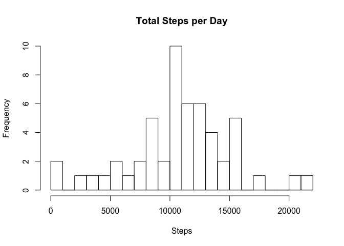
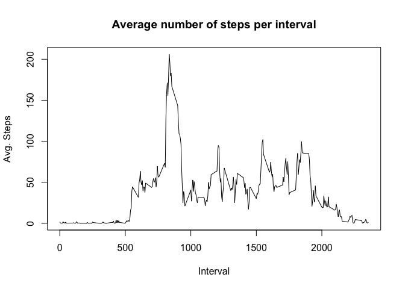
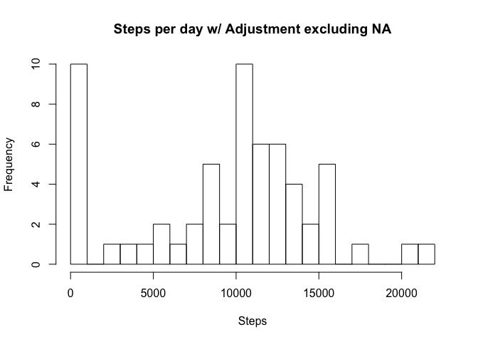
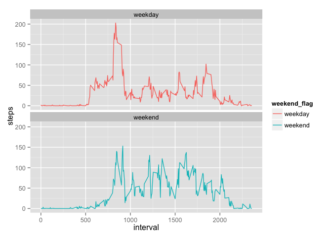

# Reproducible Research: Peer Assessment 1

This assignment makes use of data from a personal activity monitoring device. This device collects data at 5 minute intervals through out the day. The data consists of two months of data from an anonymous individual collected during the months of October and November, 2012 and include the number of steps taken in 5 minute intervals each day.

## Loading and preprocessing the data


```r
library(ggplot2) 
#if(file.exists("./data")){dir.create("./data")}
#fileUrl <- "https://d396qusza40orc.cloudfront.net/repdata%2Fdata%2Factivity.zip"
#download.file(fileUrl,destfile="./data/Factivity.zip")
#unzip("./activity.zip", exdir="./data")
db_activity <- read.csv("./data/activity.csv")

#get familiar w the source
head(db_activity)
```

```
##   steps       date interval
## 1    NA 2012-10-01        0
## 2    NA 2012-10-01        5
## 3    NA 2012-10-01       10
## 4    NA 2012-10-01       15
## 5    NA 2012-10-01       20
## 6    NA 2012-10-01       25
```

```r
str(db_activity)
```

```
## 'data.frame':	17568 obs. of  3 variables:
##  $ steps   : int  NA NA NA NA NA NA NA NA NA NA ...
##  $ date    : Factor w/ 61 levels "2012-10-01","2012-10-02",..: 1 1 1 1 1 1 1 1 1 1 ...
##  $ interval: int  0 5 10 15 20 25 30 35 40 45 ...
```

```r
summary(db_activity)
```

```
##      steps                date          interval     
##  Min.   :  0.00   2012-10-01:  288   Min.   :   0.0  
##  1st Qu.:  0.00   2012-10-02:  288   1st Qu.: 588.8  
##  Median :  0.00   2012-10-03:  288   Median :1177.5  
##  Mean   : 37.38   2012-10-04:  288   Mean   :1177.5  
##  3rd Qu.: 12.00   2012-10-05:  288   3rd Qu.:1766.2  
##  Max.   :806.00   2012-10-06:  288   Max.   :2355.0  
##  NA's   :2304     (Other)   :15840
```


## What is mean total number of steps taken per day?

```r
?hist
?aggregate
#aggregates steps by date, instead of interval
Steps_per_Date <- aggregate(steps ~ date,data=db_activity, sum, na.rm = TRUE)

hist(Steps_per_Date$steps, breaks = 30,
     main="Total Steps per Day", 
     xlab="Steps",
     ylab="Frequency")
```

 

The plot highlights the range between 10k and 13k as most frequent. 
We also observe two outliers 1) lazy: with low activy below 2k and 2) Go_getters with an above average activity beyond 20k per day.


STEP3: Mean and median number of steps taken each day

```r
mean_steps <-mean(Steps_per_Date$steps,na.rm=TRUE)
median_steps<-median(Steps_per_Date$steps, na.rm = TRUE)

mean_steps
```

```
## [1] 10766.19
```

```r
median_steps
```

```
## [1] 10765
```

## What is the average daily activity pattern?

P4: Time series plot of the average number of steps taken

```r
Data_mean<- aggregate(steps ~ interval, data= db_activity, mean, na.rm = TRUE)
```
 
This provides the average number of steps per interval regardless of date


```r
plot(Data_mean$steps ~ Data_mean$interval
     , type="l"
     , main = "Average number of steps per interval"
     , xlab = "Interval"
     , ylab = "Avg. Steps" 
     )
```

 

P5: The 5-minute interval that, on average, contains the maximum number of steps
 

```r
head(Data_mean)
```

```
##   interval     steps
## 1        0 1.7169811
## 2        5 0.3396226
## 3       10 0.1320755
## 4       15 0.1509434
## 5       20 0.0754717
## 6       25 2.0943396
```

```r
## provides which row
which.max(Data_mean$steps)
```

```
## [1] 104
```

```r
## outputs row
Data_mean[which.max(Data_mean$steps),]
```

```
##     interval    steps
## 104      835 206.1698
```

```r
#P6: Code to describe and show a strategy for imputing missing data

#Since there are some na values across the 
#data, this may result in a bias analysis. 
## This may well be also a reason why the delta between mean and median is so small for instance. 

#gets all missing values
na_data <- sum(is.na(db_activity$steps))
print(paste("Number of missing values in the source", na_data, "rows."))
```

```
## [1] "Number of missing values in the source 2304 rows."
```

```r
#one can replace na for zero, for mean or median.
# median seems more accurate as it takes skewness into consideration.
fixed_data<- db_activity

#STEP7: Histogram of the total number of steps taken each day after missing values are imputed
fixed_data$steps[is.na(fixed_data$steps)] <- median(db_activity$steps, na.rm=TRUE)

fixed_data_per_day <- aggregate(steps ~ date, data=fixed_data, sum, na.rm=TRUE)

hist(fixed_data_per_day$steps, breaks= 30, main = "Steps per day w/ Adjustment excluding NA" , xlab="Steps" )
```

 


Are there differences in activity patterns between weekdays and weekends?

STEP8: Panel plot comparing the average number of steps taken per 5-minute interval across weekdays and weekends


```r
fixed_data$date <- as.Date(fixed_data$date)
str(fixed_data$date)
```

```
##  Date[1:17568], format: "2012-10-01" "2012-10-01" "2012-10-01" "2012-10-01" ...
```

```r
fixed_data$datename <- weekdays(fixed_data$date)

##creates factors for weekend
##gets weekdays and weekends


fixed_data$weekend_flag <- as.factor(ifelse(fixed_data$datename =="Saturday" | fixed_data$datename =="Sunday","weekend","weekday" ))
interval_summary <- aggregate(steps ~ interval + weekend_flag, fixed_data, mean)
head(interval_summary)
```

```
##   interval weekend_flag      steps
## 1        0      weekday 2.02222222
## 2        5      weekday 0.40000000
## 3       10      weekday 0.15555556
## 4       15      weekday 0.17777778
## 5       20      weekday 0.08888889
## 6       25      weekday 1.31111111
```

```r
plot <- ggplot(interval_summary, aes(x=interval, y=steps, color = weekend_flag)) +
            geom_line() + facet_wrap(~weekend_flag, ncol = 1, nrow=2)
print(plot)
```

 

Differences can be observed in the activity patterns between weekdays and weekends.

